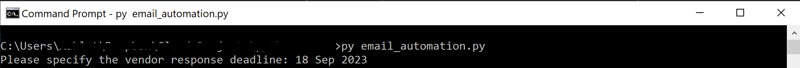

# Python Email Automation for Vendor Payment Reminders

## Introduction
In our daily work, there is often a need to send regular email reminders to our colleagues or customers, prompting them to take certain actions or reminding them of important matters, such as making payments.
<br/>
In this project, I have utilized Python and the Pandas library to transform and enhance the original raw data. Additionally, I have also merged email addresses from another file. This modified dataset will be used to programmatically send emails to vendors, reminding them about their outstanding payments.

## Prerequisites
Before getting started, ensure that the following prerequisites are in place:
1. Microsoft Outlook
2. A text editor (e.g., Visual Studio Code)
3. Python installed
4. Python libraries: Pandas, openpyxl, pywin32

## Getting Started
To run the email automation script:
1. Ensure that the necessary file and contact details are saved in a folder.
<br/>
Original raw data:
<br/>

<br/>
Contact details file:
<br/>


2. The script will navigate to the specified folder and search for the latest file based on the specified file pattern.
<br/>


3. The data will be transformed and the respective contact details would be added in to the modified file.
4. Python will sort the data and send out the email to each vendor based on their information.
<br/>


## Running the Script

In the command prompt:
```
cd /to/your/file/path
py email_automation.py
```

The script will prompt for the deadline, which must be in DD MMM YYYY format.



Once the date has been entered, the script will run and generate the email.


## Results

After running the Python script, the modified dataset should include calculated aging days, overdue status, and vendor names, along with their contact details.
The CSV will be saved in the selected folder.


An email draft would also be generated and it can be found under the Outlook Draft folder.

